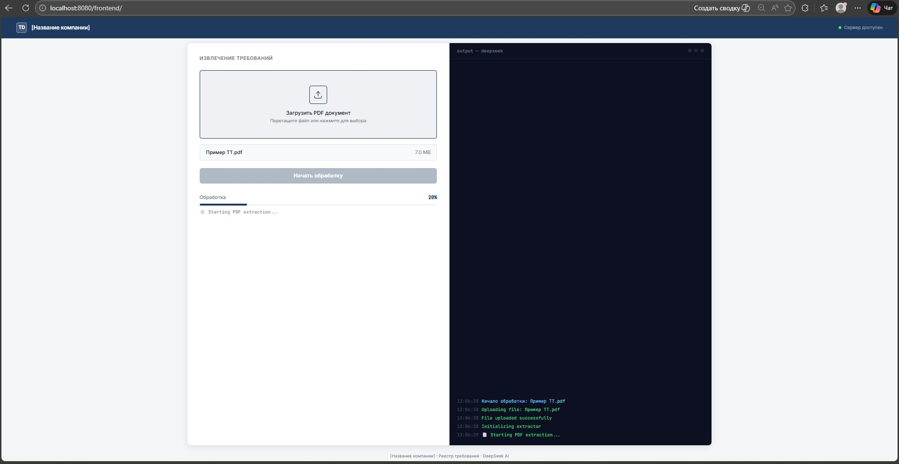
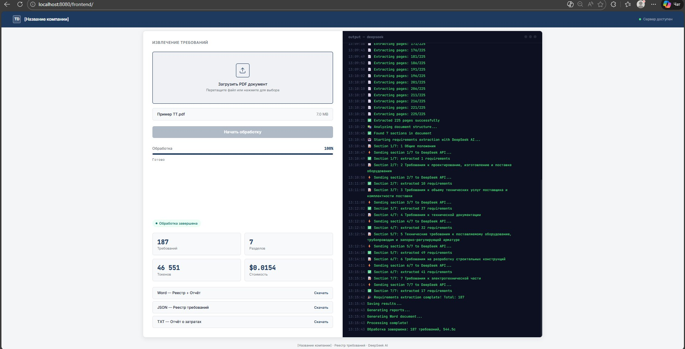

# PDF Requirements Extractor
**Автоматизированная система извлечения требований из технической документации**

---

## 📖 Что это?

Это инструмент для **автоматического анализа технических документов** (ТЗ, спецификаций, ГОСТов). Система "читает" PDF-файлы с помощью искусственного интеллекта и извлекает из них все требования, структурируя их в удобный реестр.

**Простыми словами:**
Вы загружаете PDF-документ на 200 страниц → система анализирует его с помощью AI → вы получаете Word-документ с таблицей всех требований, их типами, приоритетами и ссылками.

---

## 🚀 Ключевые возможности

### Для пользователя
- 📤 **Простая загрузка** - перетащите PDF прямо в браузер
- ⏱️ **Быстрая обработка** - технология параллельной обработки ускоряет работу в 3-5 раз
- 📊 **Живой прогресс** - видите, как обрабатывается каждая страница в реальном времени
- 💰 **Прозрачность затрат** - точный расчет стоимости использования AI для каждого документа
- 📥 **Готовые результаты** - получаете Word-документ с реестром и отчетом

### Для технического специалиста
- 🤖 **AI-анализ** - интеграция с DeepSeek API для интеллектуального извлечения
- ⚡ **Параллельная обработка** - многопоточное извлечение страниц и асинхронные запросы к API
- 🎯 **Умная классификация** - автоматическое определение типа (технические, функциональные) и приоритета требований
- 🔄 **Надежность** - автоматические повторные попытки при сбоях
- 📝 **Структурированный вывод** - JSON-реестр и Word-документ с детальной информацией

---

## 💻 Примеры интерфейса

<div align="center">

<p align="center">
  
  
</p>

</div>

---

## 🎯 Быстрый старт

### Самый простой способ (Windows)

1. **Установите Python 3.11+** 
2. **Получите API-ключ DeepSeek** на [platform.deepseek.com](https://platform.deepseek.com)
3. **Запустите скрипт установки:**
   ```bash
   # В папке проекта выполните:
   start_server.bat
   ```
   При первом запуске скрипт автоматически:
   - Создаст виртуальное окружение
   - Установит все зависимости
   - Попросит ввести API-ключ DeepSeek
   - Запустит сервер

4. **Откройте браузер:** `http://localhost:8080/frontend/`
5. **Загрузите PDF** и начните обработку!

---

## 📋 Системные требования

- **Python:** версия 3.11 или выше
- **ОС:** Windows 10/11, Linux, macOS
- **RAM:** минимум 4 ГБ (рекомендуется 8 ГБ для больших документов)
- **CPU:** 2+ ядра (чем больше, тем быстрее обработка)
- **Интернет:** стабильное соединение для API-запросов
- **DeepSeek API:** активный ключ с балансом

---

## 📁 Структура проекта

```
pdf-requirements-extractor/
├── 🌐 frontend/                  # Веб-интерфейс
│   └── index.html                # Главная страница с загрузкой PDF
│
├── 🐍 src/                       # Основной код системы
│   ├── config.py                 # Настройки (API-ключи, параметры)
│   ├── deepseek_client.py        # Клиент для AI-анализа (синхронный и асинхронный)
│   ├── extractor.py              # Главный модуль извлечения требований
│   ├── logger.py                 # Система логирования
│   ├── models.py                 # Структуры данных (требования, разделы)
│   ├── pdf_processor.py          # Обработка PDF (многопоточная)
│   └── usage_tracker.py          # Подсчет стоимости использования AI
│
├── 🧪 tests/                     # Автоматические тесты
│   └── test_extractor.py
│
├── 📂 data/                      # Рабочие файлы
│   ├── uploads/                  # Загруженные PDF (через веб-интерфейс)
│   ├── output/                   # Результаты обработки (JSON, Word)
│   ├── images/                   # Извлеченные изображения из PDF
│   └── test/                     # Тестовые данные
│
├── 📝 logs/                      # Журналы работы системы
│
├── 🚀 api_server.py              # Backend-сервер (FastAPI + WebSocket)
├── 🔧 main.py                    # Точка входа для CLI-использования
├── 📋 requirements.txt           # Список Python-библиотек
├── 🔐 .env                       # API-ключи (создается при установке)
├── 🪟 start_server.bat           # Автоматический запуск (Windows)
├── 🐧 start_server.sh            # Автоматический запуск (Linux/Mac)
│
└── 📚 Документация
    ├── README.md                 # Этот файл
    └──DEPLOYMENT_GUIDE.md       # Развертывание (Docker, cloud)

```

### 🔑 Ключевые файлы для пользователя

- **`frontend/index.html`** - откройте в браузере для работы
- **`data/output/`** - здесь появляются результаты
- **`.env`** - здесь хранится ваш API-ключ
- **`logs/`** - здесь логи, если нужно разобраться в ошибке

---

## 🎯 Использование

### 🌐 Веб-интерфейс (Рекомендуется)

Самый удобный способ работы - через браузер:

#### **Автоматический запуск (Windows):**
```bash
start_server.bat
```
Скрипт запустит и backend, и frontend автоматически. Браузер откроется сам.

#### **Ручной запуск:**

1. **Запустите API-сервер:**
   ```bash
   python api_server.py
   ```
   Сервер запустится на `http://localhost:8000`

2. **Запустите веб-интерфейс (в новом окне терминала):**
   ```bash
   python -m http.server 8080
   ```

3. **Откройте в браузере:**
   ```
   http://localhost:8080/frontend/
   ```

#### **Как использовать:**

1. **Загрузите PDF:**
   - Перетащите файл в зону загрузки, или
   - Нажмите на иконку и выберите файл

2. **Начните обработку:**
   - Нажмите кнопку "Начать обработку"

3. **Наблюдайте за прогрессом:**
   ```
   📄 Extracting pages: 1/225
   📄 Extracting pages: 5/225
   ...
   📚 Parsing document structure...
   🤖 [Section 1/10] Extracting...
   ✅ Extraction complete!
   ```

4. **Скачайте результаты:**
   - 📄 **Word** - полный реестр требований + отчет о затратах
   - 📋 **JSON** - структурированный реестр для обработки
   - 📊 **TXT** - текстовый отчет об использовании API

---

### ⚡ Как работает параллельная обработка

Система использует современные технологии для максимальной скорости:

#### **1. Многопоточное извлечение страниц**
- PDF разбивается на страницы
- Каждая страница обрабатывается в отдельном потоке
- **Ускорение:** 3-4x на многоядерных процессорах

#### **2. Параллельный AI-анализ**
- Все разделы документа анализируются одновременно
- Используется пул асинхронных запросов к DeepSeek API
- **Ускорение:** до 5x при обработке 10+ разделов

#### **3. Адаптивная настройка**
- Система автоматически определяет оптимальное количество потоков
- Учитывается количество ядер процессора
- Есть защита от перегрузки API (лимит параллельных запросов)

---

### 💻 Использование через Python API (для разработчиков)

```python
from pathlib import Path
from src.extractor import create_extractor
import asyncio

# Создать экстрактор
extractor = create_extractor(
    pdf_path=Path("data/input/specification.pdf"),
    output_dir=Path("data/output"),
    log_level="INFO"
)

# ⚡ БЫСТРЫЙ способ (параллельная обработка):
async def extract_fast():
    manual_toc = [
        {
            "level": 1,
            "number": "1",
            "title": "Введение",
            "page_start": 1,
            "children": []
        },
        # ... другие разделы
    ]
    
    registry_path = await extractor.run_full_extraction_async(manual_toc=manual_toc)
    print(f"Реестр сохранен в: {registry_path}")

# Запуск
asyncio.run(extract_fast())

# 🐢 МЕДЛЕННЫЙ способ (последовательная обработка, для совместимости):
# registry_path = extractor.run_full_extraction(manual_toc=manual_toc)
```

---

## 📊 Что вы получите на выходе

### 1. 📄 Word-документ (главный результат)

**Содержит две части:**

#### **Часть 1: Реестр требований**
Таблица с извлеченными требованиями:

| ID | Требование | Тип | Приоритет | Ссылка | Раздел |
|----|------------|-----|-----------|--------|--------|
| REQ-1-001 | Система должна поддерживать 100 одновременных пользователей | Техническое | Обязательно | ГОСТ 34.602-2020 | 1 Введение |
| REQ-1-002 | Интерфейс должен быть на русском языке | Функциональное | Обязательно | - | 1 Введение |

**Типы требований:**
- 🔧 **Техническое** - производительность, архитектура, протоколы
- ⚙️ **Функциональное** - что система должна делать
- 📋 **Организационное** - процессы, роли, ответственность
- 📝 **Документационное** - какие документы нужны
- 🚫 **Нефункциональное** - безопасность, надежность, доступность
- 📌 **Прочее** - остальное

**Приоритеты:**
- 🔴 **Обязательно** - must have
- 🟡 **Желательно** - should have
- 🟢 **Опционально** - nice to have

#### **Часть 2: Отчет о затратах**
```
════════════════════════════════════════════════════════════════
ОТЧЕТ ОБ ИСПОЛЬЗОВАНИИ DeepSeek API
════════════════════════════════════════════════════════════════

Всего API-запросов: 9
Всего токенов (входящих): 10,533
Всего токенов (исходящих): 18,934
Всего токенов: 29,467

💰 ОБЩАЯ СТОИМОСТЬ: $0.0109 USD (≈0.93 ₽)

────────────────────────────────────────────────────────────────
ДЕТАЛИЗАЦИЯ ПО РАЗДЕЛАМ
────────────────────────────────────────────────────────────────

Раздел: 1 Общие сведения
  Запросов: 1
  Токенов (вход): 963
  Токенов (выход): 1,382
  Стоимость: $0.0009
  
Раздел: 2 Назначение и цели
  Запросов: 1
  ...
```

### 2. 📋 JSON-файл (для обработки)

Структурированные данные для дальнейшей обработки программами:

```json
{
  "metadata": {
    "total_sections": 5,
    "total_requirements": 42
  },
  "sections": [
    {
      "section": "1 Введение",
      "page_range": "1-3",
      "requirements": [
        {
          "id": "REQ-1-001",
          "text": "Система должна поддерживать 100 одновременных пользователей",
          "type": "Техническое",
          "priority": "Обязательно",
          "reference": "ГОСТ 34.602-2020",
          "page_number": null,
          "section": "1 Введение"
        }
      ]
    }
  ]
}
```

### 3. 📊 Текстовый отчет (usage_report.txt)

Детальная разбивка затрат на использование AI для вашей бухгалтерии.

---

## 💰 Стоимость использования

### Цены DeepSeek API (актуально на февраль 2026)

| Тип токенов | Стоимость |
|-------------|-----------|
| Входящие (Input) | $0.28 за 1 млн токенов |
| Исходящие (Output) | $0.42 за 1 млн токенов |

### 📊 Примерные затраты

| Объем документа | Примерная стоимость | Примечание |
|-----------------|---------------------|------------|
| 3 страницы ТЗ | ~$0.01 (≈0.85 ₽) | Тестовый документ |
| 10 страниц | ~$0.04 (≈3.4 ₽) | Небольшая спецификация |
| 50 страниц | ~$0.18 (≈15 ₽) | Средний документ |
| 100 страниц | ~$0.36 (≈31 ₽) | Большая спецификация |
| 225 страниц | ~$0.81 (≈69 ₽) | Полное ТЗ |
| 500 страниц | ~$1.80 (≈153 ₽) | ГОСТ или стандарт |
| 1000 страниц | ~$3.60 (≈306 ₽) | Комплект документации |

**Примечание:** Курс $1 ≈ 85 ₽ 

### 💡 Что влияет на стоимость?

1. **Количество страниц** - чем больше текста, тем больше токенов
2. **Сложность структуры** - больше разделов = больше запросов к API
3. **Плотность текста** - таблицы и списки обрабатываются эффективнее длинных абзацев
4. **Язык** - русский текст занимает больше токенов, чем английский

### 📝 Контроль затрат

Система автоматически:
- ✅ Считает точное количество использованных токенов
- ✅ Рассчитывает стоимость каждого запроса
- ✅ Предоставляет детальный отчет по разделам
- ✅ Показывает общую сумму в долларах

Отчет включается в итоговый Word-документ.

---

## ⚙️ Настройка и конфигурация

### Базовая конфигурация (.env файл)

```env
DEEPSEEK_API_KEY=your-api-key-here
```

---

## 🛠️ Техническая архитектура

### Как это работает внутри?

```
1. Загрузка PDF
   ↓
2. Многопоточное извлечение страниц (ThreadPoolExecutor)
   [Страница 1] [Страница 2] ... [Страница N] → все параллельно!
   ↓
3. Анализ структуры документа (DeepSeek AI)
   Поиск оглавления, разделов, номеров страниц
   ↓
4. Параллельная обработка разделов (asyncio.gather)
   [Раздел 1] [Раздел 2] ... [Раздел M] → все параллельно!
   ↓
5. Извлечение требований (DeepSeek AI для каждого раздела)
   Поиск требований, классификация, приоритизация
   ↓
6. Структурирование и сохранение
   JSON + Word + Отчет
```

### Основные компоненты

| Компонент | Назначение | Технология |
|-----------|------------|------------|
| **Frontend** | Веб-интерфейс | HTML/CSS/JavaScript |
| **API Server** | Backend + WebSocket | FastAPI (Python) |
| **PDF Processor** | Извлечение текста | pymupdf + многопоточность |
| **DeepSeek Client** | AI-анализ | httpx + asyncio |
| **Usage Tracker** | Подсчет затрат | Python decorators |
| **Document Generator** | Создание Word | python-docx |

### Технологии параллелизма

#### 1. **ThreadPoolExecutor** (для PDF)
- **Зачем:** Извлечение страниц — это CPU-bound операция
- **Как:** Каждая страница обрабатывается в отдельном потоке
- **Результат:** Ускорение в 3-4 раза на многоядерных процессорах

#### 2. **asyncio.gather** (для API)
- **Зачем:** Запросы к AI — это I/O-bound операция
- **Как:** Отправляем все запросы сразу, ждем все ответы
- **Результат:** Ускорение до 5 раз при обработке 10+ разделов

#### 3. **Semaphore** (защита от перегрузки)
- **Зачем:** Не "заспамить" API слишком большим количеством запросов
- **Как:** Ограничение на количество одновременных запросов (по умолчанию 5)
- **Результат:** Стабильная работа без ошибок rate limit

---

## 🔐 Безопасность

- ✅ Логи не содержат чувствительных данных
- ✅ Валидация всех входных данных
- ✅ Безопасная работа с файловой системой (защита от path traversal)

---

## 🎓 Технический стек

### Backend
- **Python 3.11+** - основной язык
- **FastAPI** - асинхронный веб-фреймворк
- **httpx** - HTTP-клиент с async поддержкой
- **asyncio** - асинхронное программирование
- **ThreadPoolExecutor** - многопоточность
- **pymupdf / pymupdf4llm** - обработка PDF
- **python-docx** - генерация Word
- **python-dotenv** - переменные окружения
- **pydantic** - валидация данных

### Frontend
- **HTML5/CSS3** - современный интерфейс
- **Vanilla JavaScript** - без тяжелых фреймворков
- **WebSocket API** - real-time коммуникация
- **Fetch API** - AJAX-запросы

### DevOps
- **Docker & Docker Compose** - контейнеризация
- **Nginx** - reverse proxy
- **pytest** - тестирование
- **black, isort** - форматирование кода
- **mypy** - статическая типизация

---

## 🎯 Roadmap

📋 **Подробный план развития:** [`ROADMAP.md`](ROADMAP.md)

**Включает:**
- 8 фаз с техническими деталями и примерами кода
- Обоснование выбора технологий
- Расчеты окупаемости для локальных моделей
- Требования к железу (GPU)
- Приоритизация и метрики успеха

---

<div align="center">

</div>
