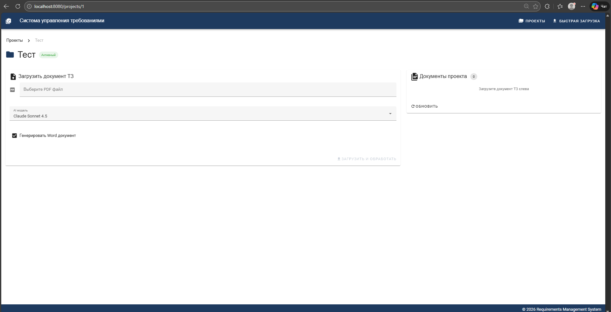
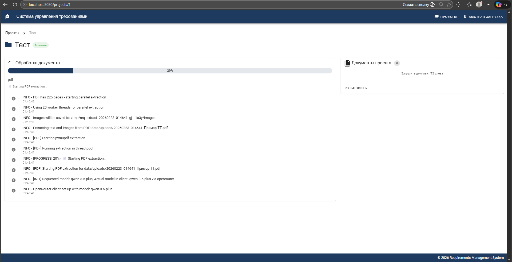
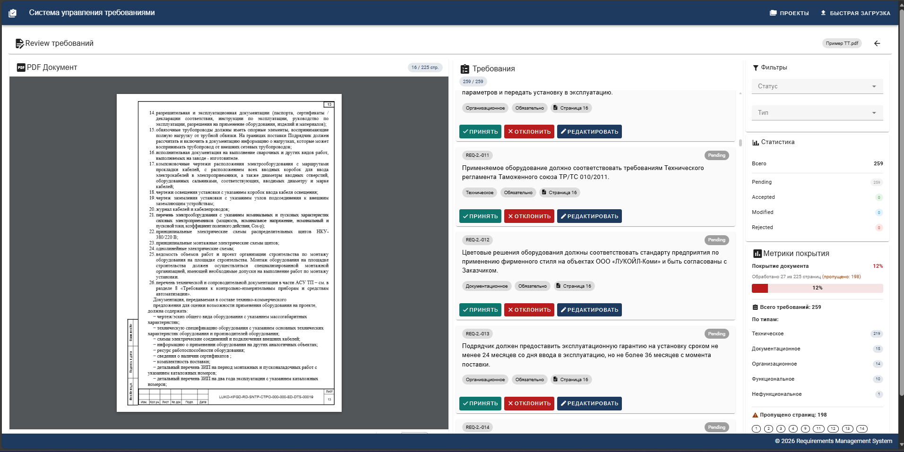
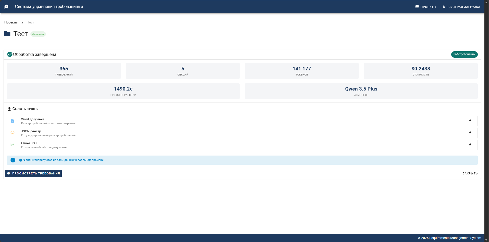

# Requirements Management System

Система управления требованиями из технической документации.

Загрузка PDF -> извлечение требований с помощью AI -> хранение в БД -> review инженером -> контроль исполнения.

<p align="center">
  
  
</p>

<p align="center">
  
  
</p>

---

## Что умеет

- **Проекты** — группировка документов по проектам
- **Извлечение требований** — текст + изображения (multimodal AI через OpenRouter)
- **Привязка к источнику** — каждое требование привязано к странице PDF
- **Review workflow** — accept / reject / edit с сохранением истории
- **Аудит** — видно, что предложил AI и что изменил человек
- **Метрика покрытия** — сколько страниц обработано, сколько пропущено
- **Экспорт** — Word, JSON, TXT (генерируется на лету из БД)
- **Split-view** — PDF слева, требования справа, клик по номеру страницы

---

## Быстрый старт (Docker)

```bash
# 1. Клонировать и настроить
git clone https://github.com/OlgaKalinina101/requirements_extractor.git
cd requirements_extractor
cp .env.example .env
# Отредактировать .env — вписать OPENROUTER_API_KEY

# 2. Запустить
docker-compose up -d

# 3. Открыть
# http://localhost:8080
```

Поднимается три контейнера: PostgreSQL, API (FastAPI), Frontend (Vue + Nginx).

Посмотреть логи:

```bash
docker logs requirements-extractor-api 2>&1 | Select-String -Pattern "extract|POST|ERROR|error|document|DB|traceback|Exception" -CaseSensitive:$false | Select-Object -Last 50
```

---

## Локальная разработка

**Требования:** Python 3.11+, Node.js 18+, PostgreSQL (через Docker)

```bash
# БД
docker-compose up -d postgres

# Backend
pip install -r requirements.txt
cp .env.example .env   # вписать ключи
python api_server.py   # http://localhost:8000

# Frontend
cd frontend-vue
npm install
npm run dev            # http://localhost:3000
```

---

## Структура проекта

```
├── api_server.py            # FastAPI backend (основной файл)
├── src/
│   ├── database/
│   │   ├── models.py        # SQLAlchemy: Project, Document, Section, Requirement, CoverageMetrics
│   │   ├── crud.py          # CRUD-операции
│   │   └── database.py      # Подключение к PostgreSQL
│   ├── openrouter_client.py # Клиент OpenRouter API
│   ├── requirements_extractor.py # Логика извлечения требований
│   ├── pdf_processor.py     # Обработка PDF (pymupdf4llm)
│   ├── prompts.py           # Загрузка промптов
│   ├── prompts.yaml         # Промпты для AI (текст + изображения)
│   ├── config.py            # Конфигурация
│   ├── models.py            # Pydantic-модели
│   ├── logger.py            # Логирование
│   └── usage_tracker.py     # Трекинг токенов и стоимости
├── frontend-vue/            # Vue 3 + Vuetify + Pinia
│   ├── src/
│   │   ├── views/           # ProjectsView, ProjectView, HomeView, ReviewView
│   │   ├── components/      # DocumentUpload, PDFViewer, RequirementCard, MetricsPanel
│   │   ├── stores/          # Pinia: projects, documents, requirements
│   │   └── services/api.js  # Axios API client
│   └── vite.config.js
├── alembic/                 # Миграции БД
├── scripts/                 # Утилиты (init_db, check_db, create_tables.sql)
├── docs/                    # Документация
├── docker-compose.yml
├── Dockerfile               # Backend image
├── Dockerfile.frontend      # Frontend image (multi-stage build)
├── nginx.conf               # Nginx: frontend + API proxy
├── requirements.txt
└── ROADMAP.md               # План развития
```

---

## Модель данных

```
Project
  └── Document (PDF файл)
        ├── Section (раздел документа)
        │     └── Requirement (требование)
        └── CoverageMetrics (метрика покрытия)
```

**Requirement** хранит:
- `text` — текст требования
- `type` — тип (Техническое, Функциональное, ...)
- `priority` — приоритет (Обязательно, Желательно, Опционально)
- `page_number` — страница в PDF
- `status` — pending / accepted / rejected / modified
- `ai_suggested` — исходный текст от AI
- `human_edited` — текст после правки инженером
- `edit_reason`, `edited_by`, `edited_at` — аудит

---

## API

| Метод | Endpoint | Описание |
|-------|----------|----------|
| GET | `/api/projects` | Список проектов |
| POST | `/api/projects` | Создать проект |
| GET | `/api/projects/{id}` | Проект с документами |
| PUT | `/api/projects/{id}` | Обновить проект |
| DELETE | `/api/projects/{id}` | Удалить проект |
| POST | `/api/extract` | Загрузить PDF и извлечь требования |
| GET | `/api/documents` | Список документов (фильтр `?project_id=`) |
| GET | `/api/documents/{id}` | Документ |
| GET | `/api/documents/{id}/pdf` | PDF файл |
| GET | `/api/documents/{id}/requirements` | Требования (фильтры: `status`, `type`) |
| GET | `/api/documents/{id}/metrics` | Метрика покрытия |
| POST | `/api/requirements/{id}/accept` | Принять требование |
| POST | `/api/requirements/{id}/reject` | Отклонить (с причиной) |
| POST | `/api/requirements/{id}/edit` | Редактировать |
| GET | `/api/documents/{id}/export/word` | Экспорт Word |
| GET | `/api/documents/{id}/export/json` | Экспорт JSON |
| GET | `/api/documents/{id}/export/txt` | Экспорт TXT |
| WS | `/ws/logs` | WebSocket: прогресс обработки |

---

## Технологии

**Backend:** Python 3.11, FastAPI, SQLAlchemy, PostgreSQL, psycopg3, Alembic, pymupdf4llm, python-docx

**Frontend:** Vue 3, Vuetify 3, Pinia, Vue Router, PDF.js, Axios, Vite

**AI:** OpenRouter API (Claude, GPT-4.1, Gemini, Qwen — multimodal)

**Инфраструктура:** Docker, Docker Compose, Nginx

---

## Roadmap

Подробный план: [`ROADMAP.md`](ROADMAP.md)

**Ближайшие приоритеты:**
1. Качество извлечения (промпты, классификация, приоритеты)
2. Расширенный жизненный цикл требований (ответственные, статусы исполнения)
3. Diff версий документов (ключевая ценность)
4. Верификация числовых значений, аудит AI-действий
